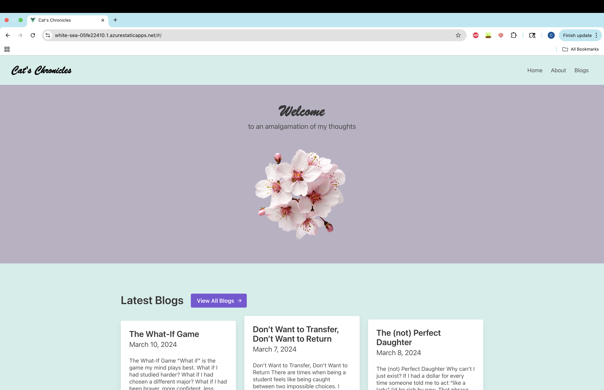
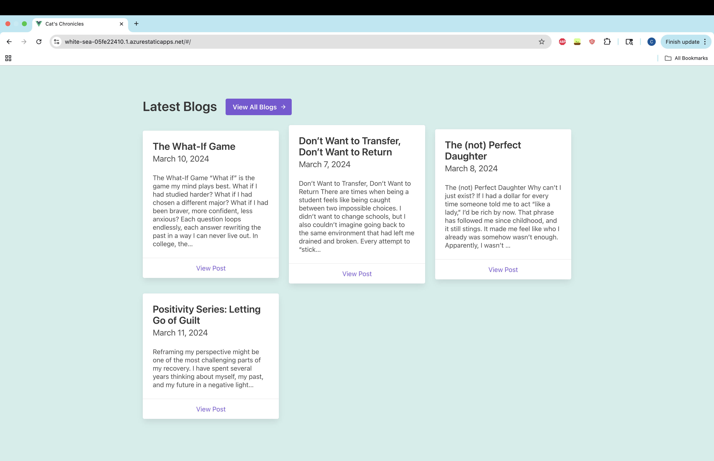
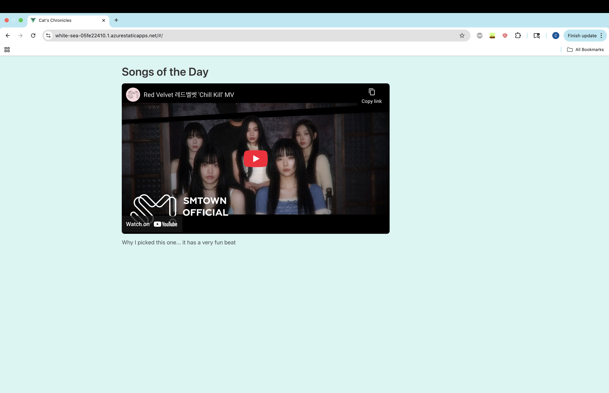
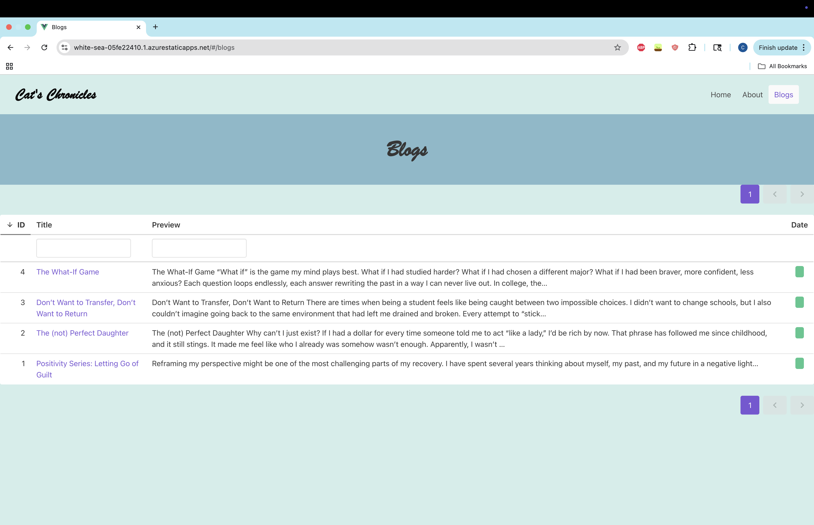
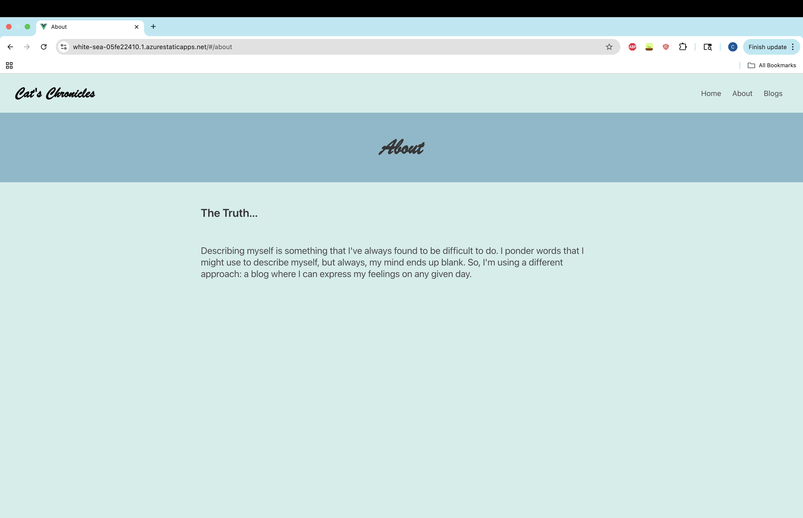
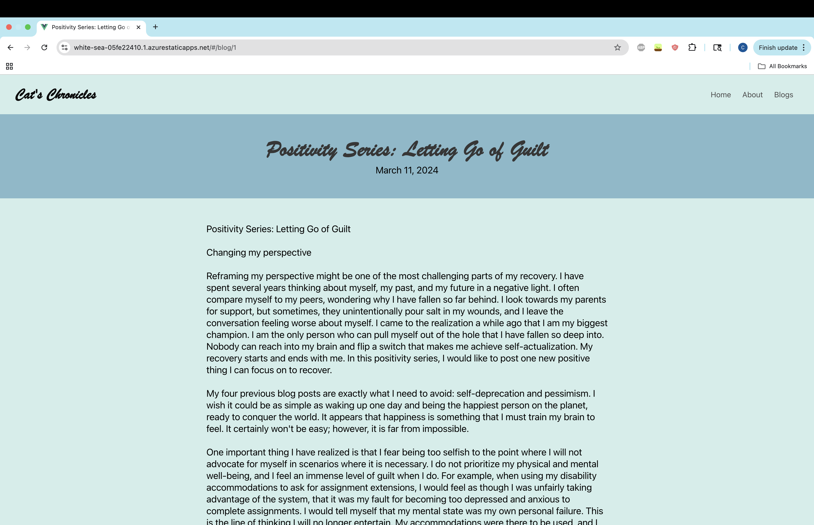

# Cat’s Chronicles 📝

A personal blog platform built with **Vue.js** and **Buefy**, deployed on **Azure Static Web Apps**.  
This project is my way of exploring front-end development, design consistency, and web deployment workflows.

---

## 🌐 Live Demo
[Visit the site here](https://white-sea-05fe22410.1.azurestaticapps.net)

---

## ✨ Features
- **Home Page** with highlighted sections and “Song of the Day.”
- **Blog List** showing all posts with title, date, and preview.
- **Individual Blog Pages** with full content.
- **About Page** describing the blog’s purpose.
- **Responsive Design** with clean layouts using Buefy (Bulma + Vue.js).
- **Azure CI/CD**: GitHub Actions build and deploy to Azure Static Web Apps.

---

## 🚀 Tech Stack
- [Vue.js](https://vuejs.org/)  
- [Buefy](https://buefy.org/) (Bulma + Vue components)  
- [Azure Static Web Apps](https://azure.microsoft.com/en-us/services/app-service/static/)  
- [GitHub Actions](https://github.com/features/actions) for CI/CD  

---

## 📸 Screenshots

### Home Page
<p align="center">
  
</p>
<p align="center">
  
</p>
<p align="center">
  
</p>

### Blog List
<p align="center">
  
</p>

### About Page
<p align="center">
  
</p>

### Individual Blog
<p align="center">
  
</p>

---

## ⚙️ Getting Started

### Prerequisites
- [Node.js](https://nodejs.org/) (v16+ recommended)
- npm or yarn

### Install and Run Locally
```bash
# clone the repo
git clone https://github.com/YOUR_USERNAME/blog-platform.git
cd blog-platform

# install dependencies
npm install

# run locally
npm run serve
